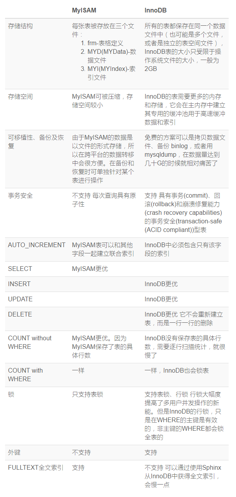

## 存储引擎
MySQL 默认的存储引擎是 MyISAM，其他常用的就 InnoDB 了。

两者的具体区别：

## 锁
对于InnoDB表，主要有以下几点
  * （１）InnoDB的行销是基于索引实现的，如果不通过索引访问数据，InnoDB会使用表锁。
  * （２）InnoDB间隙锁机制，以及InnoDB使用间隙锁的原因。
  * （３）在不同的隔离级别下，InnoDB的锁机制和一致性读策略不同。
  * （４）ＭySQL的恢复和复制对InnoDB锁机制和一致性读策略也有较大影响。
  *  （５）锁冲突甚至死锁很难完全避免。

   在了解InnoDB的锁特性后，用户可以通过设计和SQL调整等措施减少锁冲突和死锁，包括：
* 尽量使用较低的隔离级别
* 精心设计索引，并尽量使用索引访问数据，使加锁更精确，从而减少锁冲突的机会。
* 选择合理的事务大小，小事务发生锁冲突的几率也更小。
* 给记录集显示加锁时，最好一次性请求足够级别的锁。比如要修改数据的话，最好直接申请排他锁，而不是先申请共享锁，修改时再请求排他锁，这样容易产生死锁。
* 不同的程序访问一组表时，应尽量约定以相同的顺序访问各表，对一个表而言，尽可能以固定的顺序存取表中的行。这样可以大减少死锁的机会。
* 尽量用相等条件访问数据，这样可以避免间隙锁对并发插入的影响。
* 不要申请超过实际需要的锁级别；除非必须，查询时不要显示加锁。
* 对于一些特定的事务，可以使用表锁来提高处理速度或减少死锁的可能。

[更多内容请查看](http://www.cnblogs.com/chenqionghe/p/4845693.html)
